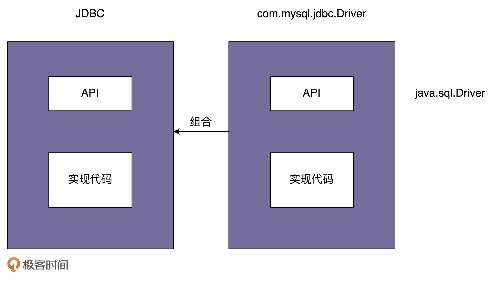
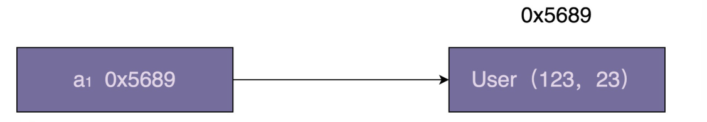
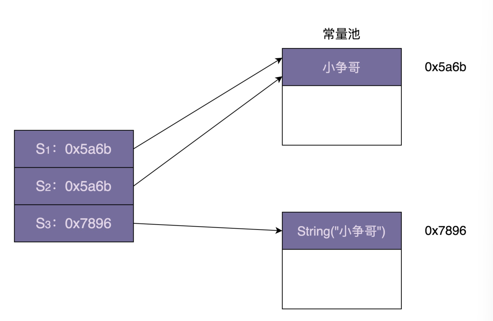
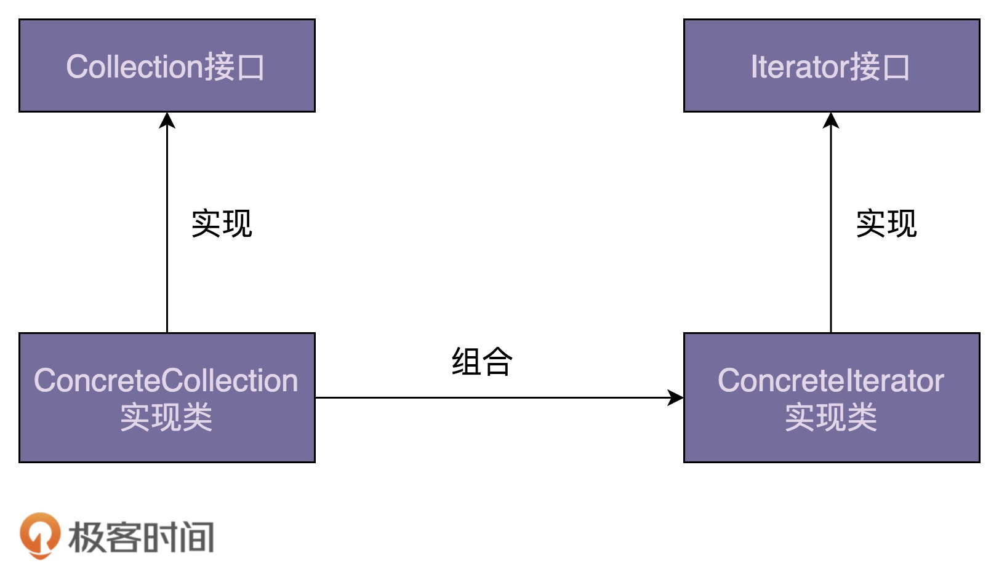

# 面向对象

封装、继承、抽象、多态。

**封装**

信息隐藏或数据访问保护。类通过暴露有限的访问接口，授权外部仅能通过类提供的方式来访问内部信息或数据。

```java
// 参照封装特性，对钱包四个属性的访问方式进行了限制。
/**
 * 金融系统中一个简化版的虚拟钱包
 */
public class Wallet {
    private String id;
    private long createTime;
    private BigDecimal balance;
    private long balanceLastModifiedTime;
    // ...省略其他属性...

    public Wallet() {
        this.id = IdGenerator.getInstance().generate();
        this.createTime = System.currentTimeMillis();
        this.balance = BigDecimal.ZERO;
        this.balanceLastModifiedTime = System.currentTimeMillis();
    }

    // 注意：下面对get方法做了代码折叠，是为了减少代码所占文章的篇幅
    public String getId() { return this.id; }
    public long getCreateTime() { return this.createTime; }
    public BigDecimal getBalance() { return this.balance; }
    public long getBalanceLastModifiedTime() { return this.balanceLastModifiedTime;  }

    public void increaseBalance(BigDecimal increasedAmount) {
        if (increasedAmount.compareTo(BigDecimal.ZERO) < 0) {
            throw new InvalidAmountException("...");
        }
        this.balance.add(increasedAmount);
        this.balanceLastModifiedTime = System.currentTimeMillis();
    }

    public void decreaseBalance(BigDecimal decreasedAmount) {
        if (decreasedAmount.compareTo(BigDecimal.ZERO) < 0) {
            throw new InvalidAmountException("...");
        }
        if (decreasedAmount.compareTo(this.balance) > 0) {
            throw new InsufficientAmountException("...");
        }
        this.balance.subtract(decreasedAmount);
        this.balanceLastModifiedTime = System.currentTimeMillis();
    }
}


public interface IPictureStorage {
    void savePicture(Picture picture);
    Image getPicture(String pictureId);
    void deletePicture(String pictureId);
    void modifyMetaInfo(String pictureId, PictureMetaInfo metaInfo);
}

public class PictureStorage implements IPictureStorage {
    // ...省略其他属性...
    @Override
    public void savePicture(Picture picture) { ... }
    @Override
    public Image getPicture(String pictureId) { ... }
    @Override
    public void deletePicture(String pictureId) { ... }
    @Override
    public void modifyMetaInfo(String pictureId, PictureMetaInfo metaInfo) { ... }
}
```

封装依赖于编程语言**访问权限控制**的语法机制

封装的意义：

1. 保护数据不被随意修改，提高代码的可维护性；
2. 仅暴露有限的必要接口，提高类的易用性。

**抽象**

隐藏方法的具体实现，让调用者只需要关心方法提供了哪些功能，不需要关心如何实现的。

常使用接口类(interface)或抽象类(abstract)来实现抽象。

```java
// 调用者使用图片存储功能，只需要了解IPictureStorage这个接口暴露了哪些方法，不需要去查看PictureStorage类的具体逻辑实现
public interface IPictureStorage {
    void savePicture(Picture picture);
    Image getPicture(String pictureId);
    void deletePicture(String pictureId);
    void modifyMetaInfo(String pictureId, PictureMetaInfo metaInfo);
}

public class PictureStorage implements IPictureStorage {
    // ... 省略其他属性...
    @Override
    public void savePicture(Picture picture) { ... }
    @Override
    public Image getPicture(String pictureId) { ... }
    @Override
    public void deletePicture(String pictureId) { ... }
    @Override
    public void modifyMetaInfo(String pictureId, PictureMetaInfo metaInfo) { ...}
    
}
```

抽象并不需要非得依赖接口类或抽象类，PictureStorage类本身就满足抽象特性，通过函数包裹具体的实现逻辑，本身就是一种抽象。

抽象的意义：

1. 提高代码的可扩展性、维护性，修改实现不需要改变定义，减少代码的改动范围；
2. 处理复杂系统的有效手段，能有效地过滤掉不必要关注的信息。

**继承**

表示类之间的is-a关系，单继承、多继承(Java仅支持单继承)

继承的意义：

1. 代码复用。

多用组合，少用继承(子、父类高度耦合，可维护性差；可读性差)

**多态**

子类可以替换父类

```java
public class DynamicArray {
    private static final int DEFAULT_CAPACITY = 10;
    protected int size = 0;
    protected int capacity = DEFAULT_CAPACITY;
    protected Integer[] elements = new Integer[DEFAULT_CAPACITY];

    public int size() {
        return this.size;
    }

    public Integer get(int index) {
        return elements[index];
    }

    //...省略n多方法...
    public void add(Integer e) {
        ensureCapacity();
        elements[size++] = e;
    }

    protected void ensureCapacity() {
        //...如果数组满了就扩容...代码省略...
    }
}

public class SortedDynamicArray extends DynamicArray {
    @Override
    public void add(Integer e) {
        ensureCapacity();
        int i;
        for (i = size - 1; i >= 0; --i) {
            //保证数组中的数据有序
            if (elements[i] > e) {
                elements[i + 1] = elements[i];
            } else {
                break;
            }
        }
        elements[i + 1] = e;
        ++size;
    }
}

public class Example {
    public static void test(DynamicArray dynamicArray) {
        dynamicArray.add(5);
        dynamicArray.add(1);
        dynamicArray.add(3);
        for (int i = 0; i < dynamicArray.size(); ++i) {
            System.out.println(dynamicArray.get(i));
        }
    }

    public static void main(String args[]) {
        DynamicArray dynamicArray = new SortedDynamicArray();
        test(dynamicArray); // 打印结果：1、3、5
    }
}
```

上面的例子中用到了三个语法机制来实现多态：

1. 父类对象可以引用子类对象，即可以将SortedDynamicArray传递给DynamicArray；
2. 继承；
3. 子类可以重写父类中的方法

利用接口类实现多态特性：

```java
public interface Iterator {
  String hasNext();
  String next();
  String remove();
}

public class Array implements Iterator {
  private String[] data;
  
  public String hasNext() { ... }
  public String next() { ... }
  public String remove() { ... }
  //...省略其他方法...
}

public class LinkedList implements Iterator {
  private LinkedListNode head;
  
  public String hasNext() { ... }
  public String next() { ... }
  public String remove() { ... }
  //...省略其他方法... 
}

public class Demo {
  private static void print(Iterator iterator) {
    while (iterator.hasNext()) {
      System.out.println(iterator.next());
    }
  }
  
  public static void main(String[] args) {
    Iterator arrayIterator = new Array();
    print(arrayIterator);
    
    Iterator linkedListIterator = new LinkedList();
    print(linkedListIterator);
  }
}
```

Iterator是一个接口类，Array和LinkedList都实现了接口类Iterator，传递不同类型的实现类到print()中，动态调用不同的next()、hasNext()实现。

多态的意义：

1. 提高代码的可扩展性和复用性

# 面向过程与面向对象

**什么是面向过程编程与面向过程编程语言？**

以过程(可以为理解方法、函数、操作)作为组织代码的基本单元，以数据(可以理解为成员变量、属性)与方法相分离为最主要的特点。

面向对象：以类或对象作为组织代码的基本单元，并将封装、抽象、继承、多态四个特性，作为代码设计和实现的基石。

面向过程(C)

```c
struct User {
    char name[64];
    int age;
    char gender[16];
};

struct User parse_to_user(char* text) {
    // 将 text(“小王 &28& 男”) 解析成结构体 struct User
} 

char* format_to_text(struct User user) {
    // 将结构体 struct User 格式化成文本（" 小王\t28\t 男 "）
} 

void sort_users_by_age(struct User users[]) {
    // 按照年龄从小到大排序 users
} 

void format_user_file(char* origin_file_path, char* new_file_path) {
    // open files...
    struct User users[1024]; // 假设最大 1024 个用户
    int count = 0;
    while(1) { // read until the file is empty
        struct User user = parse_to_user(line);
        users[count++] = user;
    } s
        ort_users_by_age(users);
    for (int i = 0; i < count; ++i) {
        char* formatted_user_text = format_to_text(users[i]);
        // write to new file...
    }
    // close files...
} 

int main(char** args, int argv) {
    format_user_file("/home/zheng/user.txt", "/home/zheng/formatted_users.txt");
}
```

面向对象(Java)

```java
public class User {
    private String name;
    private int age;
    private String gender;
    public User(String name, int age, String gender) {
        this.name = name;
        this.age = age;
        this.gender = gender;
    } 

    public static User praseFrom(String userInfoText) {
        // 将 text(“小王 &28& 男”) 解析成类 User
    }

    public String formatToText() {
        // 将类 User 格式化成文本（" 小王\t28\t 男 "）
    }
} 
public class UserFileFormatter {
    public void format(String userFile, String formattedUserFile) {
        // Open files...
        List users = new ArrayList<>();
        while (1) { // read until file is empty
            // read from file into userText...
            User user = User.parseFrom(userText);
            users.add(user);
        }
        // sort users by age...
        for (int i = 0; i < users.size(); ++i) {
            String formattedUserText = user.formatToText();
            // write to new file...
        }// close files...
    }
} 
public class MainApplication {
    public static void main(Sring[] args) {
        UserFileFormatter userFileFormatter = new UserFileFormatter();
        userFileFormatter.format("/home/zheng/users.txt", "/home/zheng/formatted_users.txt");
    }
}
```

面向过程：代码被组织成了一组方法集合及其数据结构，方法和数据结构的定义是分开的；

面向对象：代码被组织成一组类，方法和数据结构被绑定在一起，定义在类中。

1. OOP更加能够应对大规模复杂程序的开发；
2. 更易复用、易扩展、易维护；
3. 更加人性化。

# 哪些代码设计看似是面向对象，实际是面向过程的？

- **滥用 getter、setter 方法**

  ```java
  public class ShoppingCart {
    private int itemsCount;
    private double totalPrice;
    private List<ShoppingCartItem> items = new ArrayList<>();
    
    public int getItemsCount() {
      return this.itemsCount;
    }
    
    public void setItemsCount(int itemsCount) {
      this.itemsCount = itemsCount;
    }
    
    public double getTotalPrice() {
      return this.totalPrice;
    }
    
    public void setTotalPrice(double totalPrice) {
      this.totalPrice = totalPrice;
    }
  
    public List<ShoppingCartItem> getItems() {
      return this.items;
    }
    
    public void addItem(ShoppingCartItem item) {
      items.add(item);
      itemsCount++;
      totalPrice += item.getPrice();
    }
    // ...省略其他方法...
  }
  ```

  1. 虽然itemsCount 和 totalPrice是私有的，但外部可以通过public的getter、setter方法随意获取、修改；

  2. items虽然没有定义setter方法，但其getter方法返回一个List集合容器，外部调用者可以操作容器内部数据；

     ```java
     ShoppingCart cart = new ShoppCart();
     cart.getItems().clear(); // 清空购物车
     ```

     "清空购物车"会导致会导致 itemsCount、totalPrice、items 三者数据不一致。

     应该将清空购物车的业务逻辑封装在里面：

     ```java
     public class ShoppingCart {
       // ...省略其他代码...
       public void clear() {
         items.clear();
         itemsCount = 0;
         totalPrice = 0.0;
       }
     }
     ```

     不提供getter方法的话，如果需要查看购物车信息，可以通过Collections.unmodifiableList()，让getter方法返回一个不可修改的集合容器。

     ```java
     public class ShoppingCart {
         //...省略其他代码...
         public List<ShoppingCartItem> getItems() {
             return Collections.unmodifiableList(this.items);
         }
     }
     
     public class UnmodifiableList<E> extends UnmodifiableCollection<E> implements List<E> {
         public boolean add(E e) {
             throw new UnsupportedOperationException();
         }
         public void clear() {
             throw new UnsupportedOperationException();
         }
         //...省略其他代码...
     }
     
     ShoppingCart cart = new ShoppingCart();
     List<ShoppingCartItem> items = cart.getItems();
     items.clear(); // 抛出 UnsupportedOperationException 异常
     ```
     
     但调用者通过ShoppingCart 的 getItems() 获取到 items 之后，仍然可以修改容器中每个对象
     (ShoppingCartItem)的数据：
     
     ```java
     ShoppingCart cart = new ShoppingCart();
     cart.add(new ShoppingCartItem(...));
     List<ShoppingCartItem> items = cart.getItems();
     ShoppingCartItem item = items.get(0);
     item.setPrice(19.0); // 这里修改了item的价格属性
     ```
  
- **滥用全局变量和全局方法**

  单例类对象、静态成员变量、常量；静态方法。

  Constants类：

  ```java
  public class Constants {
      public static final String MYSQL_ADDR_KEY = "mysql_addr";
      public static final String MYSQL_DB_NAME_KEY = "db_name";
      public static final String MYSQL_USERNAME_KEY = "mysql_username";
      public static final String MYSQL_PASSWORD_KEY = "mysql_password";
      
      public static final String REDIS_DEFAULT_ADDR = "192.168.7.2:7234";
      public static final int REDIS_DEFAULT_MAX_TOTAL = 50;
      public static final int REDIS_DEFAULT_MAX_IDLE = 50;
      public static final int REDIS_DEFAULT_MIN_IDLE = 20;
      public static final String REDIS_DEFAULT_KEY_PREFIX = "rt:";
      
      //...省略更多的常量定义...
  }
  ```

  大而全的Constants类：影响代码的可维护性；增加代码编译时间；影响代码的复用性。

  改进思路：

  1. 将Constants类拆解为功能更加单一的多个类；
  2. 不单独设计Constants常量类，而是哪个类用到哪个常量就定义在哪个类中。

  Utils类细化，针对不同的功能设计不同的utils类。

- **定义数据和方法分离的类**

  基于贫血模型的开发模式

  MVC：Controller、Service、Repository，Repository层中的VO(View Object)、BO(Business Object)、Entity。

# 接口与抽象类的区别

**抽象类**

Logger是一个记录日志的抽象类，FileLogger和MessageQueueLogger继承Logger，分别实现两种不同的日志记录方式，两个子类复用了父类Logger中的name、enabled、minPermittedLevel属性和log()方法，但这两个子类写日志的方式不同，它们又各自重写了父类中的doLog()。

```java
// 抽象类
public abstract class Logger {
    private String name;
    private boolean enabled;
    private Level minPermittedLevel;

    public Logger(String name, boolean enabled, Level minPermittedLevel) {
        this.name = name;
        this.enabled = enabled;
        this.minPermittedLevel = minPermittedLevel;
    }
    
    public void log(Level level, String message) {
        boolean loggable = enabled && (minPermittedLevel.intValue() <= level.intValue());
        if (!loggable) return;
        doLog(level, message);
    }
    
    protected abstract void doLog(Level level, String message);
}
// 抽象类的子类: 输出日志到文件
public class FileLogger extends Logger {
    private Writer fileWriter;

    public FileLogger(String name, boolean enabled, Level minPermittedLevel, String filepath) {
        super(name, enabled, minPermittedLevel);
        this.fileWriter = new FileWriter(filepath); 
    }
    
    @Override
    public void doLog(Level level, String message) {
        // 格式化level和message, 输出到日志文件
        fileWriter.write(...);
    }
}
// 抽象类的子类: 输出日志到消息中间件(比如kafka)
public class MessageQueueLogger extends Logger {
    private MessageQueueClient msgQueueClient;
    
    public MessageQueueLogger(String name, boolean enabled, Level minPermittedLevel, MessageQueueClient msgQueueClient) {
        super(name, enabled, minPermittedLevel);
        this.msgQueueClient = msgQueueClient;
    }
    
    @Override
    protected void doLog(Level level, String message) {
        // 格式化level和message, 输出到消息中间件
        msgQueueClient.send(...);
    }
}
```

抽象类的特性：

1. **抽象类不允许被实例化，只能被继承**；
2. **抽象类可用包含属性和方法，方法可以包含代码实现(log())，也可以不包括代码实现(doLog()，叫做作抽象方法)**；
3. **子类继承抽象类必须实现抽象类中的所有抽象方法**。

**接口**

```java
// 接口
public interface Filter {
    void doFilter(RpcRequest req) throws RpcException;
}
// 接口实现类：鉴权过滤器
public class AuthenticationFilter implements Filter {
    @Override
    public void doFilter(RpcRequest req) throws RpcException {
        //...鉴权逻辑..
    }
}
// 接口实现类：限流过滤器
public class RateLimitFilter implements Filter {
    @Override
    public void doFilter(RpcRequest req) throws RpcException {
        //...限流逻辑...
    }
}
// 过滤器使用demo
public class Application {
    // filters.add(new AuthenticationFilter());
    // filters.add(new RateLimitFilter());
    private List<Filter> filters = new ArrayList<>();
    
    public void handleRpcRequest(RpcRequest req) {
        try {
            for (Filter filter : filters) {
                filter.doFilter(req);
            }
        } 
        catch(RpcException e) {
            //...处理过滤结果...
        }
        //...省略其他处理逻辑...
    }
}
```

AuthencationFilter 和 RateLimitFilter 是接口的两个实现类，分别实现了对 RPC 请求鉴权和限流的过滤功能。

接口的特性：

1. 接口不能包含属性(成员变量)；
2. 接口只能声明方法，方法不能包含代码实现；
3. 类实现接口的时候，必须实现接口中声明的所有方法。

抽象类：is-a关系

接口：has-a关系，表示具有某项功能

抽象类：

1. 代码复用，多个子类可以继承抽象类中定义的属性和方法，避免在子类中，重复编写相同的代码。
2. 使用多态特性；
3. 避免忘记重写需要重写的方法；

接口：

接口是对行为的一种抽象，相当于一组协议或者契约。

1. 约定和实现相分离，可以降低代码间的耦合性，提高代码的可扩展性。

**表示is-a的关系，并且为了解决代码复用的问题，使用抽象类；表示一种has-a的关系，为了解决抽象而非代码复用，使用接口。**

# 为什么基于接口而非实现编程？

基于抽象而非实现编程。

**越抽象、越顶层、越脱离具体某一实现的设计，越能提高代码的灵活性，越能应对未来的需求变化。好的代码设计，不仅能够应对当下的需求，而且在将来需求发生变化的时候，仍能够在不破坏原有代码设计的情况下灵活应对。**

图片经过处理之后被上传到阿里云上。

```java
public class AliyunImageStore {
  //...省略属性、构造函数等...
  
  public void createBucketIfNotExisting(String bucketName) {
    // ...创建bucket代码逻辑...
    // ...失败会抛出异常..
  }
  
  public String generateAccessToken() {
    // ...根据accesskey/secrectkey等生成access token
  }
  
  public String uploadToAliyun(Image image, String bucketName, String accessToken) {
    //...上传图片到阿里云...
    //...返回图片存储在阿里云上的地址(url）...
  }
  
  public Image downloadFromAliyun(String url, String accessToken) {
    //...从阿里云下载图片...
  }
}

// AliyunImageStore类的使用举例
public class ImageProcessingJob {
  private static final String BUCKET_NAME = "ai_images_bucket";
  //...省略其他无关代码...
  
  public void process() {
    Image image = ...; //处理图片，并封装为Image对象
    AliyunImageStore imageStore = new AliyunImageStore(/*省略参数*/);
    imageStore.createBucketIfNotExisting(BUCKET_NAME);
    String accessToken = imageStore.generateAccessToken();
    imagestore.uploadToAliyun(image, BUCKET_NAME, accessToken);
  }
  
}
```

不再将图片存储到阿里云了，而是将图片存储到自建私有云上。

1. 函数名不能暴露任何实现细节，uploadToAliyun() -> upload()
2. 封装具体的实现细节，如跟阿里云相关的特殊上传/下载流程不应该暴露给调用者
3. 为实现类定义抽象的接口，具体的实现类都依赖统一的接口定义，遵从一致的上传功能协议。使用者依赖接口，而不是具体的实现类编程。

```java
public interface ImageStore {
  String upload(Image image, String bucketName);
  Image download(String url);
}

public class AliyunImageStore implements ImageStore {
  //...省略属性、构造函数等...

  public String upload(Image image, String bucketName) {
    createBucketIfNotExisting(bucketName);
    String accessToken = generateAccessToken();
    //...上传图片到阿里云...
    //...返回图片在阿里云上的地址(url)...
  }

  public Image download(String url) {
    String accessToken = generateAccessToken();
    //...从阿里云下载图片...
  }

  private void createBucketIfNotExisting(String bucketName) {
    // ...创建bucket...
    // ...失败会抛出异常..
  }

  private String generateAccessToken() {
    // ...根据accesskey/secrectkey等生成access token
  }
}

// 上传下载流程改变：私有云不需要支持access token
public class PrivateImageStore implements ImageStore  {
  public String upload(Image image, String bucketName) {
    createBucketIfNotExisting(bucketName);
    //...上传图片到私有云...
    //...返回图片的url...
  }

  public Image download(String url) {
    //...从私有云下载图片...
  }

  private void createBucketIfNotExisting(String bucketName) {
    // ...创建bucket...
    // ...失败会抛出异常..
  }
}

// ImageStore的使用举例
public class ImageProcessingJob {
  private static final String BUCKET_NAME = "ai_images_bucket";
  //...省略其他无关代码...
  
  public void process() {
    Image image = ...;//处理图片，并封装为Image对象
    ImageStore imageStore = new PrivateImageStore(...);
    imagestore.upload(image, BUCKET_NAME);
  }
}
```

# 组合优于继承

继承层次过深、过复杂会影响到可维护性。

组合、接口、委托解决继承存在的问题：

接口表示具有某种行为特性，可以**定义一个Flyable接口，只让会飞的鸟实现这个接口**。同理，对于会叫、会下蛋这些行为特性可以类似的定义Tweetable接口、EggLayable接口。但接口自定义方法，不定义实现，即会下蛋的鸟都需要实现一边layEgg()方法，并且实现逻辑一样，会导致代码重复。可以**针对三个接口再定义三个实现类：FlyAbility、TweetAbility、EggLayAbility，然后通过组合和委托技术消除代码重复。**

```java
public interface Flyable {
  void fly()；
}
public class FlyAbility implements Flyable {
  @Override
  public void fly() { //... }
}
//省略Tweetable/TweetAbility/EggLayable/EggLayAbility
 
public class Ostrich implements Tweetable, EggLayable {//鸵鸟
  private TweetAbility tweetAbility = new TweetAbility(); //组合
  private EggLayAbility eggLayAbility = new EggLayAbility(); //组合
  //... 省略其他属性和方法...
  @Override
  public void tweet() {
    tweetAbility.tweet(); // 委托
  }
  @Override
  public void layEgg() {
    eggLayAbility.layEgg(); // 委托
  }
}
```

**如何判断该使用继承还是组合？**

如果类之间的继承结构稳定(不会轻易改变)，继承层次比较浅(比如最多有两层继承关系)，继承关系不复杂，可以使用继承。反之。系统越不稳定，继承层次很深，继承关系复杂，尽量使用组合替代继承。

# 基于充血模型的DDD

Controller层和Repository层与传统模式基本相同，Service层包含Service类和Domain类，Domain既包含数据也包含业务逻辑。

```java

public class VirtualWallet { // Domain领域模型(充血模型)
  private Long id;
  private Long createTime = System.currentTimeMillis();
  private BigDecimal balance = BigDecimal.ZERO;
  
  public VirtualWallet(Long preAllocatedId) {
    this.id = preAllocatedId;
  }
  
  public BigDecimal balance() {
    return this.balance;
  }
  
  public void debit(BigDecimal amount) {
    if (this.balance.compareTo(amount) < 0) {
      throw new InsufficientBalanceException(...);
    }
    this.balance = this.balance.subtract(amount);
  }
  
  public void credit(BigDecimal amount) {
    if (amount.compareTo(BigDecimal.ZERO) < 0) {
      throw new InvalidAmountException(...);
    }
    this.balance = this.balance.add(amount);
  }
}

public class VirtualWalletService {
  // 通过构造函数或者IOC框架注入
  private VirtualWalletRepository walletRepo;
  private VirtualWalletTransactionRepository transactionRepo;
  
  public VirtualWallet getVirtualWallet(Long walletId) {
    VirtualWalletEntity walletEntity = walletRepo.getWalletEntity(walletId);
    VirtualWallet wallet = convert(walletEntity);
    return wallet;
  }
  
  public BigDecimal getBalance(Long walletId) {
    return walletRepo.getBalance(walletId);
  }
  
  public void debit(Long walletId, BigDecimal amount) {
    VirtualWalletEntity walletEntity = walletRepo.getWalletEntity(walletId);
    VirtualWallet wallet = convert(walletEntity);
    wallet.debit(amount);
    walletRepo.updateBalance(walletId, wallet.balance());
  }
  
  public void credit(Long walletId, BigDecimal amount) {
    VirtualWalletEntity walletEntity = walletRepo.getWalletEntity(walletId);
    VirtualWallet wallet = convert(walletEntity);
    wallet.credit(amount);
    walletRepo.updateBalance(walletId, wallet.balance());
  }
  
  public void transfer(Long fromWalletId, Long toWalletId, BigDecimal amount) {
    //...跟基于贫血模型的传统开发模式的代码一样...
  }
}
```

Service类的职责：

1. Service类负责与Repository交流，Domain不与其他层(Repository层的代码)或开发框架(比如Spring、MyBatis)耦合在一起，将流程性代码(如从DB中取数据、映射数据)与领域模型的业务逻辑解耦；
2. Service 类负责跨领域模型的业务聚合功能；
3. 非功能性及与三方系统交互的工作，如幂等、事务等。

# SRP，单一职责原则

一个类或模块只负责完成一个职责或功能。

先写一个粗粒度的类，满足业务需求。随着业务的发展，如果粗粒度的类越来越大，代码越来越多，就可以将这个粗粒度的类拆分为几个更细粒度的类，持续重构。

1. 类中代码行数、函数或属性过多；
2. 类依赖的其它类过多，或者依赖类的其它类过多；
3. 私有方法过多；
4. 比较难给类起一个合适的名字；
5. 类中大量方法集中操作类中几个属性，考虑将这几个属性和对应的方法拆分出来。

# OCP，开闭原则

添加一个新的功能应该是，在已有基础代码上扩展代码(新增模块、类、方法等)，而非修改已有代码。

# LSP，里氏替换原则

子类对象能够替换程序中父类对象出现的任何地方，并且保证原来程序的逻辑行为不变及正确性不被破坏。

```java
public class Transporter {
  private HttpClient httpClient;
  
  public Transporter(HttpClient httpClient) {
    this.httpClient = httpClient;
  }

  public Response sendRequest(Request request) {
    // ...use httpClient to send request
  }
}

public class SecurityTransporter extends Transporter {
  private String appId;
  private String appToken;

  public SecurityTransporter(HttpClient httpClient, String appId, String appToken) {
    super(httpClient);
    this.appId = appId;
    this.appToken = appToken;
  }

  @Override
  public Response sendRequest(Request request) {
    if (StringUtils.isNotBlank(appId) && StringUtils.isNotBlank(appToken)) {
      request.addPayload("app-id", appId);
      request.addPayload("app-token", appToken);
    }
    return super.sendRequest(request);
  }
}

public class Demo {    
  public void demoFunction(Transporter transporter) {    
    Reuqest request = new Request();
    //...省略设置request中数据值的代码...
    Response response = transporter.sendRequest(request);
    //...省略其他逻辑...
  }
}

// 里式替换原则
Demo demo = new Demo();
demo.demofunction(new SecurityTransporter(/*省略参数*/););
```

子类SecurityTransporter的设计符合里氏替换原则，可以替换父类出现的任何位置，并保证原来代码的逻辑行为不变。

改造前，如果 appId 或者 appToken 没有设置，我们就不做校验；改造后，如果 appId 或者 appToken 没有设置，则直接抛出NoAuthorizationRuntimeException 未授权异常：

```java
// 改造后：
public class SecurityTransporter extends Transporter {
  //...省略其他代码..
  @Override
  public Response sendRequest(Request request) {
    if (StringUtils.isBlank(appId) || StringUtils.isBlank(appToken)) {
      throw new NoAuthorizationRuntimeException(...);
    }
    request.addPayload("app-id", appId);
    request.addPayload("app-token", appToken);
    return super.sendRequest(request);
  }
}
```

如果传递进 demoFunction() 函数的是父类 Transporter 对象，那 demoFunction() 函数并不会有异常抛出，但如果传递给 demoFunction() 函数的是子类 SecurityTransporter 对象，那 demoFunction() 有可能会有异常抛出。

Design By Contract，按照协议来设计。子类在设计的时候，要遵守父类的行为约定(函数声明要实现的功能；对输入、输出、异常的约定；注释中所罗列的任何特殊说明)

**违背李四替换原则的例子**

1. 子类违背父类声明要实现的功能
2. 子类违背父类对输入、输出、异常的约定
3. 子类违背父类注释中所罗列的任何特殊说明


# ISP，接口隔离原则

接口调用者不应该强迫依赖它不需要的接口。

接口：

1. 一组API接口集合；
2. 单个API接口或函数；
3. OOP中的接口概念。

单一职责原则针对的是模块、类、接口的设计，而接口隔离原则更侧重于接口的设计，如果调用者只使用部分接口或接口的部分功能，那接口的设计就不够职责单一。

# 控制反转、依赖反转、依赖注入的区别与联系

**控制反转(IOC)**

Inversion Of Control

**依赖注入(DI)**

不通过new()的方式在类内部创建依赖对象，而是将依赖的类对象在外部创建好之后，通过构造函数、函数参数等方式传递(或注入)给类使用。

**依赖反转原则(DIP)**

高层模块(调用者)不依赖底层模块(被调用者)，它们共同依赖同一个抽象，抽象不要依赖具体实现细节，具体实现细节依赖抽象。

# KISS、YAGNI原则

Keep It Simple and Stupid

**KISS原则**

1. 不要使用同事可能不懂的技术来实现代码；
2. 不要重复造轮子，要善于使用已经有的工具类库；
3. 不要过度优化。

**YAGNI原则**

You Ain't Gonna Need It

不要过度设计(预留号扩展点，等到需要再去实现)

# DRY原则

Don't Repeat Yourself

**实现逻辑重复**

实现逻辑相同，但不一定违反DRY原则，需要考虑"单一职责原则"和"接口隔离原则"。

**功能语义重复**

**代码执行重复**

**怎么提高代码复用性？**

1. 减少代码耦合
2. 满足单一职责原则
3. 模块化
4. 业务与非业务逻辑分离
5. 通用代码下沉
6. 继承、多态、抽象、封装
7. 应用模板等设计模式

# LOD(迪米特法则)

**高内聚、松耦合**

**高内聚**

相近的功能应该放到同一个类，不相近的功能不要放到同一个类中。

**松耦合**

类与类之间的依赖关系简单清晰。

不该有直接依赖关系的类之间，不要有依赖，有依赖关系的类之间，尽量只依赖必要的接口。

# 重构

大型重构：系统、模块、代码结构、类与类之间的关系；

分层、模块化、解耦、抽象可复用组件等。

小型重构：对代码细节的重构，主要针对类、函数变量代码级别；

规范命名、规范注释、消除超大类或函数、提取重复代码等等。

# :star:单例模式

  一个类只允许创建一个对象/实例。

**为什么要使用单例？**

- 处理资源访问冲突
- 全局唯一类

**如何实现一个单例？**

1. 构造函数要是private权限的；
2. 对象创建时的线程安全问题；
3. 是否支持延迟加载；
4. 考虑getInstance()性能(是否加锁)

- 饿汉式

  在类加载的时候，instance 静态实例就已经创建并初始化好，不支持延迟加载（在真正用到 IdGenerator 的时候，再创建实例）。

  ```java
  public class IdGenerator {
    private static final IdGenerator instance = new IdGenerator();
    private AtomicLong id = new AtomicLong(0);
  
    private IdGenerator() {}
  
    public static IdGenerator getInstance() {
      return instance;
    }
  
    public long getId() {
      return id.incrementAndGet();
    }
  }
  ```

- 懒汉式

  支持延迟加载，频繁加锁、释放锁，以及并发度低等问题，频繁的调用会产生性能瓶颈。

  ```java
  public class IdGeneratorLazy {
    private AtomicLong id = new AtomicLong(0);
    private static IdGeneratorLazy instance;
    private IdGeneratorLazy(){
  
    }
  
    public static synchronized IdGeneratorLazy getInstance(){
      if (instance == null){
        instance = new IdGeneratorLazy();
      }
      return instance;
    }
  
    public long getId() {
      return id.incrementAndGet();
    }
  }
  ```

- 静态内部类

  SingletonHolder 是一个静态内部类，当外部类 IdGenerator 被加载的时候，并不会创建SingletonHolder 实例对象。只有当调用 getInstance() 方法时，SingletonHolder 才会被加载，这个时候才会创建 instance。

  ```java
  public class IdGeneratorStatic {
    private AtomicLong id = new AtomicLong(0);
    private IdGeneratorStatic() {}
  
    public static IdGeneratorStatic getInstance() {
      return SingletonHolder.instance;
    }
  
    public long getId() {
      return id.incrementAndGet();
    }
    private static class SingletonHolder {
      private static final IdGeneratorStatic instance = new IdGeneratorStatic();
    }
  }
  ```

- 枚举

  ```java
  public enum IdGeneratorEnum {
    INSTANCE;
    private AtomicLong id = new AtomicLong(0);
    public long getId() {
      return id.incrementAndGet();
    }
  }
  ```

**单例存在的问题**

- OOP特性支持不友好
- 隐藏类之间的依赖关系
- 扩展性不友好
- 不支持有参数的构造函数

**多种形式的"单例"**

- 线程唯一的单例

  ```java
  public class IdGeneratorThread {
    private static final ConcurrentHashMap<Long, IdGeneratorThread> instances =
        new ConcurrentHashMap<>();
    private AtomicLong id = new AtomicLong(0);
  
    private IdGeneratorThread() {}
  
    public static IdGeneratorThread getInstance() {
      long currentThreadId = Thread.currentThread().getId();
      instances.putIfAbsent(currentThreadId, new IdGeneratorThread());
      return instances.get(currentThreadId);
    }
    public long getId() {
      return id.incrementAndGet();
    }
  }
  ```

- 集群唯一的单例

  单例对象序列化并存储到外部共享存储区（比如文件）。进程在使用这个单例对象的时候，需要先从外部共享存储区中将它读取到内存，并反序列化成对象，然后再使用，使用完成之后还需要再存储回外部共享存储区。

  ```java
  public class IdGenerator {
      private AtomicLong id = new AtomicLong(0);
      private static IdGenerator instance;
      private static SharedObjectStorage storage = FileSharedObjectStorage(/*入参省略，比如文件地址*/);
  
      private static SharedObjectStorage FileSharedObjectStorage() {
          return new SharedObjectStorage();
      }
  
      private static DistributedLock lock = new DistributedLock();
  
      private IdGenerator() {
      }
  
      public synchronized static IdGenerator getInstance() {
          if (instance == null) {
              lock.lock();
              try {
                  instance = storage.load(IdGenerator.class);
              } catch (IllegalAccessException | InstantiationException e) {
                  e.printStackTrace();
              }
          }
          return instance;
      }
  
      public void freeInstance() {
          storage.save(this, IdGenerator.class);
          instance = null; //释放对象
          lock.unlock();
      }
  
      public long getId() {
          return id.incrementAndGet();
      }
  }
  ```

# :star:工厂模式

**简单工厂模式**

**工厂方法模式**

当对象的创建逻辑比较复杂，不是简单的new一下，而是要组合其它类对象，推荐使用工厂方法模式，将复杂的创建逻辑拆分到多个工厂类中。

**抽象工厂**

一个工厂负责创建多个不同类型的对象，而不是只创建一种对象。

# :star:建造者模式

工厂模式用来创建不同但是相关类型的对象(继承同一父类或接口的一组子类)，由给定的参数来决定创建哪种类型的对象；建造者模式是用来创建一种类型的复杂对象，可以通过设置不同的可选参数，"定制化"地创建不同的对象。

# 原型模式

对象成本较大，而同一个类的不同对象之间差别不大，可以利用已有对象(原型)进行复制(拷贝)的方式来创建新对象，以达到节省创建时间的目的。

**浅拷贝**

浅拷贝只会复制对象中基本数据类型数据和引用对象的内存地址，不会递归地复制引用对象，以及引用对象的对象...

**深拷贝**

得到一份完全独立的对象。

浅拷贝不可变对象是没问题的，但对于可变对象，浅拷贝得到的对象和原始对象会共享部分数据，就可能会出现数据被修改的风险。

# :star:代理模式

不改变原始类(代理类)代码的情况下，通过引入代理类来给原始类附加功能。

**静态代理**

1. 实现相同接口；
2. 代理类继承原始类，扩展附加功能。

**动态代理**

运行时，动态的创建原始类对应的代理类，底层依赖反射语法。

1. JDK动态代理

   实现InvocationHandler接口，重写invoke方法，仅能够代理实现了接口的类。

2. CGLIB动态代理

   实现MethodInterceptor接口，重写intercept方法，动态创建被代理类的子类拦截方法，不能代理final修饰的类和方法。

**应用场景**

1. 非功能性需求

   监控、鉴权、限流、事务、日志等。Spring AOP的原理就是基于动态代理。

2. RPC、缓存

   RPC框架也可以看作一种代理模式，远程代理，客户端使用远程RPC服务时，像使用本地函数一样。

# 桥接模式

"将抽象和实现解耦，让它们可以独立变化"

JDBC驱动



实现系统可能有多角度分类，每一种分类都有可能变化，那么就把这种多角度分离出来让它们独立变化，减少它们之间的耦合。

# :star:装饰器模式

Java IO库

解决继承关系过于复杂的问题，通过组合来代替继承，给原始类添加增强功能。

1. 装饰器和原始类继承同样的父类，可以对原始类"嵌套"多个装饰器；

   对FileInputStream嵌套了两个装饰器：BufferedInputStream和DataInputStream，让它即支持缓存读取，又支持按照基本数据类型来读取数据。

   ```java
   InputStream in = new FileInputStream("/user/wangzheng/test.txt");
   InputStream bin = new BufferedInputStream(in);
   DataInputStream din = new DataInputStream(bin);
   int data = din.readInt();
   ```

2. 装饰器类是对功能的增强。

# :star:适配器模式

将不兼容的接口转换为可兼容的接口，让原本由于接口不兼容不能一起工作的类可以一起工作。

类适配器：使用继承关系来实现；

对象适配器：使用组合关系来实现。

```java
ITarget：要转化成的接口定义
Adaptee：不兼容ITarget接口定义的接口
Adaptor：将Adaptee转化成一组符合ITarget接口定义的接口
// 类适配器: 基于继承
public interface ITarget {
void f1();
void f2();
void fc();
}
public class Adaptee {
public void fa() { //... }
public void fb() { //... }
public void fc() { //... }
}
public class Adaptor extends Adaptee implements ITarget {
public void f1() {
super.fa();
}
public void f2() {
//...重新实现f2()...
}
// 这里fc()不需要实现，直接继承自Adaptee，这是跟对象适配器最大的不同点
}
    
    
    
// 对象适配器：基于组合
public interface ITarget {
void f1();
void f2();
void fc();
}
public class Adaptee {
    public void fa() { //... }
	public void fb() { //... }
	public void fc() { //... }
}
public class Adaptor implements ITarget {
private Adaptee adaptee;
public Adaptor(Adaptee adaptee) {
this.adaptee = adaptee;
}
public void f1() {
adaptee.fa(); //委托给Adaptee
}
public void f2() {
//...重新实现f2()...
}
public void fc() {
adaptee.fc();
}
}
```

如果Adaptee接口并不多，两种都可以；如果接口Adaptee接口很多，而且Adaptee和ITarget接口定义大部分都相同，推荐使用类适配器；否则推荐使用对象适配器。

**应用场景**

1. 封装有缺陷的接口

2. 统一多个类的接口设计

3. 替换依赖的外部系统

4. 兼容老版本接口

5. 适配不同格式的数据

**代理、桥接、装饰器、适配器的区别**

- 代理模式：不改变原始类接口的条件下，为原始类定义一个代理类，主要目的是控制访问，而非加强功能。
- 桥接模式：桥接模式的目的是将接口部分和实现部分分离，从而让它们可以较为容易、也相对独立地加以改变。
- 装饰器模式：在不改变原始类接口的情况下，对原始类功能进行增强，并且支持多个装饰器的嵌套使用。
- 适配器模式：事后的补救策略，适配器提供跟原始类不同的接口，而代理模式、装饰器模式提供的都是跟原始类相同的接口。

# 门面模式

为子系统提供一组统一的接口，定义一组高层接口让子系统更易用。

**应用场景**

1. 解决易用性问题

2. 解决性能问题

   多个接口调用替换为一个门面接口调用，减少网络通信成本。

3. 解决分布式事务问题

# 组合模式

将一组对象组成树形结构，将单个对象和组合对象都看做树中的节点，以统一处理逻辑，并且利用树形结构的特点，递归处理每个子树，简化代码实现。

# 享元模式

"享元"，被共享的单元。复用对象，节省内存，前提是享元对象是不可变对象。

"不可变对象"，一旦通过构造函数初始化完成之后，它的状态(对象的成员变量或者属性)就不会再修改了。之所以，不可变对象不能暴露任何 set() 等修改内部状态的方法。

代码结构：通过工厂模式，在工厂类中，通过一个Map来缓存已经创建过的享元对象，来达到复用的目的。

**享元模式 vs 单例、缓存、对象池**

在单例模式中，一个类只能创建一个对象，而在享元模式中，一个类可以创建多个对象，每个对象被多处代码引用共享。

池化技术中的“复用”可以理解为“重复使用”，主要目的是节省时间（比如从数据库池中取一个连接，不需要重新创建）。在任意时刻，每一个对象、连接、线程，并不会被多处使用，而是被一个使用者独占，当使用完成之后，放回到池中，再由其他使用者重复利用。享元模式中的“复用”可以理解为“共享使用”，在整个生命周期中，都是被所有使用者共享的，主要目的是节省空间。


```java
Integer i1 = 56;
Integer i2 = 56;
Integer i3 = 129;
Integer i4 = 129;
System.out.println(i1 == i2); //true
System.out.println(i3 == i4); //false
```

```java
Integer i = 56; //自动装箱 Integer i = Integer.valueOf(56)
int j = i; //自动拆箱 int j = i.intValue();
```

Java对象是如何在内存中存储的？

```java
User a = new User(123, 23); // id=123, age=23
```

a 存储的值是 User 对象的内存地址，在图中就表现为 a 指向 User 对象。



引用类型："=="来判定两个对象是否相等时实际是判断两个局部变量存储的内存地址是否相同(是否指向相同对象)，基本数据类型：比较值是否相等；equals()，未重写：引用类型所指向的对象

i1 == i2 true?

Integer使用了享元模式来复用对象，自动装箱，调用valueOf()来创建 Integer 对象的时候，如果创建的Integer对象在-128-127之间，会从IntegerCache 类中直接返回，否则才调用 new 方法创建。

```java
    public static Integer valueOf(int i) {
        if (i >= IntegerCache.low && i <= IntegerCache.high)
            return IntegerCache.cache[i + (-IntegerCache.low)];
        return new Integer(i);
    }
```

为什么是-128-127？

IntegerCache被加载时，缓存的享元对象会集中一次性创建好，太多会使加载IntegerCache类的时间变长。

```java
// 优先使用后两种创建整形对象
Integer a = new Integer(123);
Integer a = 123;
Integer a = Integer.valueOf(123);
```


```java
String s1 = "小争哥";
String s2 = "小争哥";
String s3 = new String("小争哥");
System.out.println(s1 == s2); //true
System.out.println(s1 == s3); //false
```

String类利用享元模式复用相同的字符串常量，JVM"字符串常量池"：



# :star:观察者模式

在对象之间定义一个一对多的依赖，当一个对象状态改变时，所有依赖的对象都会自动收到通知。

被依赖对象：被观察者；依赖对象：观察者

同步阻塞：代码解耦；异步非阻塞：代码解耦，提高效率；进程间观察者模式：基于消息队列

**Guava EventBus**

```java
public class UserController {
  private static final int DEFAULT_EVENTBUS_THREAD_POOL_SIZE = 20;
  private UserService userService; // 依赖注入
  private EventBus eventBus;
  public UserController() {
    // eventBus = new EventBus(); // 同步阻塞模式
    eventBus = new AsyncEventBus(Executors.newFixedThreadPool(DEFAULT_EVENTBUS_THREAD_POOL_SIZE));
  }
  public void setRegObservers(List<Object> observers) {
    for (Object observer : observers) {
      eventBus.register(observer);
    }
  }
  public Long register(String telephone, String password) {
    long userId = userService.register(telephone, password);
    eventBus.post(userId);
    return userId;
  }
}

public class RegNotificationObserver {
  private NotificationService notificationService;
  // 基于 EventBus，我们不需要定义 Observer 接口，任意类型的对象都可以注册到 EventBus 中，
  // 通过 @Subscribe 注解来标明类中哪个函数可以接收被观察者发送的消息。
  @Subscribe
  public void handleRegSuccess(long userId) {
    notificationService.sendInboxMessage(userId, "...");
  }
}
```

# :star:模板模式

**复用**

模板模式把一个算法中不变的流程抽象到父类的模板方法 templateMethod() 中，将可变的部分 method1()、method2() 留给子类 ContreteClass1 和 ContreteClass2 来实现。所有的子类都可以复用父类中模板方法定义的流程代码。

1. InputStream

   ```java
   public abstract class InputStream implements Closeable {
       //模板方法，定义了读取数据的整个流程
       public int read(byte b[], int off, int len) throws IOException {
           if (b == null) {
               throw new NullPointerException();
           } else if (off < 0 || len < 0 || len > b.length - off) {
               throw new IndexOutOfBoundsException();
           } else if (len == 0) {
               return 0;
           }
   
           int c = read();
           if (c == -1) {
               return -1;
           }
           b[off] = (byte)c;
   
           int i = 1;
           try {
               for (; i < len ; i++) {
                   c = read();
                   if (c == -1) {
                       break;
                   }
                   b[off + i] = (byte)c;
               }
           } catch (IOException ee) {
           }
           return i;
       }
       //暴露一个可以由子类来定制的抽象方法
       public abstract int read() throws IOException;
   }
   
   public class ByteArrayInputStream extends InputStream {
       @Override
   	public synchronized int read() {
   		return (pos < count) ? (buf[pos++] & 0xff) : -1;
   	}
   }
   ```

2. AbstractList

   ```java
   public abstract class AbstractList<E> extends AbstractCollection<E> implements List<E> {
       //模板方法
       public boolean addAll(int index, Collection<? extends E> c) {
           rangeCheckForAdd(index);
           boolean modified = false;
           for (E e : c) {
               add(index++, e);
               modified = true;
           }
           return modified;
       }
       //子类需要重写的方法
       public void add(int index, E element) {
           throw new UnsupportedOperationException();
       }
   }
   ```

**扩展**

1. Junit

   编写的测试类都要继承框架提供的TestCase 类。在 TestCase 类中，runBare() 函数是模板方法，它定义了执行测试用例的整体流程：先执行 setUp() 做些准备工作，然后执行 runTest() 运行真正的测试代码，最后执行 tearDown() 做扫尾工作。

   ```java
   public abstract class TestCase extends Assert implements Test {  
    public void runBare() throws Throwable {
       Throwable exception = null;
       this.setUp();
       try {
         this.runTest();
       } catch (Throwable running) {
   	  exception = running;
       } finally {
         try {
           this.tearDown();
         } catch (Throwable tearingDown) {
   		if (exception == null) exception = tearingDown;
           }
         }
       }
   
       if (exception != null)  throw exception;
   }
   
     protected void setUp() throws Exception {
     }
   }
   ```

模板方法定义为 final，可以避免被子类重写。需要子类重写的方法定义为 abstract，可以强迫子类去实现。

复用：所有的子类可以复用父类中提供的模板方法的代码；

扩展：框架通过模板模式提供功能扩展点，让框架用户可以在不修改框架源码的情况下，基于扩展点定制化框架的功能。

**模板&回调**

回调基于组合关系来实现，把一个对象传递给另一个对象，是一种对象之间的关系；模板模式基于继承关系来实现，子类重写父类的抽象方法，是一种类之间的关系。

# :star:策略模式

1. 策略的定义

   一个策略接口和一组实现这个接口的策略类，所有的策略类都实现相同的接口，所以，客户端代码基于接口而非实现编程。

   ```java
   public interface Strategy {
     void algorithmInterface();
   }
   
   
   public class ConcreteStrategyA implements Strategy{
     @Override
     public void algorithmInterface() {
       //具体的算法...
     }
   }
   
   public class ConcreteStrategyB implements Strategy{
     @Override
     public void algorithmInterface() {
       //具体的算法...
     }
   }
   ```

2. 策略的创建

   把根据 type 创建策略的逻辑抽离出来，放到工厂类中。

   ```java
   public class StrategyFactory {
     private static final Map<String, Strategy> strategies = new HashMap<>();
     static {
       strategies.put("A", new ConcreteStrategyA());
       strategies.put("B", new ConcreteStrategyA());
     }
     public static Strategy getStrategy(String type) {
       if (type == null || type.isEmpty()) {
         throw new IllegalArgumentException("type should not be empty.");
       }
       return strategies.get(type);
     }
   }
   ```

3. 策略的使用

   ```java
   public class Demo {
     public static void main(String[] args) throws IOException {
       //运行时动态确定
       Strategy strategy = StrategyFactory.getStrategy("A");
       //代码中指定使用哪种策略(退化成"接口编程")
       Strategy strategy = new ConcreteStrategyA();
     }
   }
   ```

添加新策略的时候，避免对策略工厂类的修改：通过一个配置文件或者自定义的 annotation 来标注都有哪些策略类；策略工厂类读取配置文件或者搜索被 annotation 标注的策略类，然后通过反射了动态地加载这些策略类、创
建策略对象。添加一个策略的时候，只需要将这个新添加的策略类添加到配置文件或者用 annotation 标注即可。

# :star:责任链模式

多个处理器依次处理同一个请求。一个请求先经过 A 处理器处理，然后再把请求传递给 B 处理器，B 处理器处理完后再传递给 C 处理器，以此类推，形成一个链条。链条上的每个处理器各自承担各自的处理职责，所以叫作职责链模式。

应用场景：Servlet Filter，Spring Interceptor

# 状态模式

**有限状态机**

状态机有3部分组成：状态(State)、事件(Event)、动作(Action)，事件也称转移条件(Transition Condition)。事件触发状态的转移及动作的执行。

**状态模式**

将事件触发的状态转移和动作执行，拆分到不同的状态类中，来避免分支判断逻辑。

# 迭代器模式

迭代器模式将集合对象的遍历操作从集合类中拆分出来，放到迭代器类中，让两者的职责更加单一。

容器包含容器接口、容器实现类，迭代器包含迭代器接口、迭代器实现类。



迭代器中需要定义hasNext()，currentItem()，next()三个最基本的方法。待遍历的容器对象通过依赖注入传递到迭代器类中。容器通过 iterator() 方法来创建迭代器。

迭代器的优势：

1. 迭代器模式封装集合内部的复杂数据结构，直接使用容器提供的迭代器即可；
2. 迭代器模式将集合对象的遍历操作从集合类中拆分出来，放到迭代器类中，让两者的职责更加单一；
3. 迭代器模式让添加新的遍历算法更加容易，更符合开闭原则

迭代器遍历集合元素时，增加或者删除集合中的元素，可能会导致某个元素被重复遍历或遍历不到。

迭代器remove()：迭代器类lastRet成员变量，用来记录游标指向的前一个元素。通过迭代器去删除这个元素的时候，更新迭代器中的游标和lastRet值，来保证迭不会因为删除元素而导致某个元素遍历不到。

# 访问者模式

针对一组类型不同的对象(PdfFile、PPTFile、WordFile)。它们继承相同的父类(ResouceFile)或者实现相同的接口。在不同的应用场景下，需要对这组对象进行一系列不相关的业务操作(抽取文本、压缩等)，为了避免不断增加功能导致类(PdfFile、PPTFile、WordFile)不断膨胀，职责越来越不单一，以及避免频繁地添加功能导致频繁的代码修改，使用访问者模式，将对象与操作解耦，将这些业务抽离出来，定义在独立细分的访问者类(Extractor、Compressor)中。

Double Dispatch双分派：面向对象编程语言中，方法调用可以理解为一种消息传递(Dispatch)，消息包含对象名、方法名和参数。执行哪个对象的方法，根据对象的运行时类型来决定；执行对象的哪个方法，根据方法参数的
运行时类型来决定。

Single Dispatch：执行哪个对象的方法，根据对象的运行时类型来决定；执行对象的哪个方法，根据方法参数的编译时类型来决定。

# 备忘模式

也叫快照模式，存储副本以便后期恢复；在不违背封装原则的前提下，进行对象的备份和恢复。

对于大对象的备份来说，备份占用的存储空间会比较大，备份和恢复的耗时会比较长。针对这个问题，不同的业务场景有不同的处理方式。比如，只备份必要的恢复信息，结合最新的数据来恢复；再比如，全量备份和增量备份相结合，低频全量备份，高频增量备份，两者结合来做恢复。

# 命令模式

将函数封装成对象。控制命令的执行，比如，排队、异步、延迟执行命令、给命令执行记录日志、撤销重做命令等等。

# 解释器模式

将语法解析的工作拆分到各个小类中，以此来避免大而全的解析类。一般的做法是，将语法规则拆分成一些小的独立的单元，然后对每个单元进行解析，最终合并为对整个语法规则的解析。

# 中介模式

定义一个单独的(中介)对象，来封装一组对象之间的交互。将这组对象之间的交互委派给中介对象交互，来避免对象之间的直接交互。

中介模式的设计思想跟中间层很像，通过引入中介这个中间层，将一组对象之间的交互关系（或者说依赖关系）从多对多（网状关系）转换为一对多（星状关系）。原来一个对象要跟 n 个对象交互，现在只需要跟一个中介对象交互，从而最小化对象之间的交互关系，降低了代码的复杂度，提高了代码的可读性和可维护性。

**与观察者模式的区别**

在观察者模式的应用场景中，参与者之间的交互比较有条理，一般都是单向的，一个参与者只有一个身份，要么是观察者，要么是被观察者。而在中介模式的应用场景中，参与者之间的交互关系错综复杂，既可以是消息的发送者、也可以同时是消息的接收者。

# JDK

## Calendar：工厂模式，建造者模式

**工厂模式**

getInstance() 方法可以根据不同TimeZone 和 Locale，创建不同的 Calendar 子类对象，比如 BuddhistCalendar、JapaneseImperialCalendar、GregorianCalendar，这些细节完全封装在工厂方法中，使用者只需要传递当前的时区和地址，就能够获得一个 Calendar 类对象来使用。

**建造者模式**

Calender内部类Builder

**工厂模式与建造者模式的区别**

工厂模式是用来创建不同但是相关类型的对象(继承同一父类或者接口的一组子类)，由给定的参数来决定创建哪种类型的对象；建造者模式用来创建一种类型的复杂对象，通过设置不同的参数，"定制化"的创建不同对象。

## Collections：装饰器模式，适配器模式

**装饰器模式**

装饰器模式中的装饰器类是对原始类功能的增强；UnmodifiableCollection的构造函数接收一个Collection类对象然后对其所有函数进行了包裹(Wrap)，重新实现或者封装。

**适配器模式**

适配器模式可以用来兼容老的版本接口；Enumeration 类是适配器类。适配客户端代码（使用
Enumeration 类）和新版本 JDK 中新的迭代器 Iterator 类。

## Runtime：单例模式

每个 Java 应用在运行时会启动一个 JVM 进程，每个 JVM 进程都只对应一个 Runtime 实例，用于查看 JVM 状态以及控制 JVM 行为。进程内唯一，所以比较适合设计为单例。

```java
//饿汉式
public class Runtime {
    private static Runtime currentRuntime = new Runtime();
    public static Runtime getRuntime() {
        return currentRuntime;
    }
}
```

模板模式：JUnit TestCase、Java InputStream

享元模式：Integer IntegerCache:-128-127

责任链模式：Java Servlet Filter

# Spring

## 适配器模式

统一多个类的接口设计

Spring 定义了统一的接口 HandlerAdapter，并且对每种 Controller 定义了对应的适配器类。这些适配器类包括：RequestMappingHandlerAdapter、SimpleControllerHandlerAdapter、SimpleServletHandlerAdapter 等。

```java
public interface HandlerAdapter {
	boolean supports(Object handler);

	@Nullable
	ModelAndView handle(HttpServletRequest request, HttpServletResponse response, Object handler) throws Exception;

	@Deprecated
	long getLastModified(HttpServletRequest request, Object handler);
}
//对应实现Controller接口的Controller
public class SimpleControllerHandlerAdapter implements HandlerAdapter {

}
//对应实现Servlet接口的Controller
public class SimpleServletHandlerAdapter implements HandlerAdapter {
}
//对应通过注解实现的Controller
public class RequestMappingHandlerAdapter extends AbstractHandlerMethodAdapter
		implements BeanFactoryAware, InitializingBean {
}
```

## 策略模式

Spring 支持两种动态代理实现方式，一种是 JDK 提供的动态代理实现方式，另一种是 Cglib 提供的动态代理实现方式。前者需要被代理的类有抽象的接口定义，后者不需要。针对不同的被代理类，Spring 会在运行时动态地选择不同的动态代理实现方式。

```java
public class DefaultAopProxyFactory implements AopProxyFactory, Serializable {
	private static final long serialVersionUID = 7930414337282325166L;
	@Override
	public AopProxy createAopProxy(AdvisedSupport config) throws AopConfigException {
		if (!NativeDetector.inNativeImage() &&
				(config.isOptimize() || config.isProxyTargetClass() || hasNoUserSuppliedProxyInterfaces(config))) {
			Class<?> targetClass = config.getTargetClass();
			if (targetClass == null) {
				throw new AopConfigException("TargetSource cannot determine target class: " +
						"Either an interface or a target is required for proxy creation.");
			}
            //动态选择哪种策略
			if (targetClass.isInterface() || Proxy.isProxyClass(targetClass) || ClassUtils.isLambdaClass(targetClass)) {
				return new JdkDynamicAopProxy(config);
			}
			return new ObjenesisCglibAopProxy(config);
		}else {
			return new JdkDynamicAopProxy(config);
		}
	}

	private boolean hasNoUserSuppliedProxyInterfaces(AdvisedSupport config) {
		Class<?>[] ifcs = config.getProxiedInterfaces();
		return (ifcs.length == 0 || (ifcs.length == 1 && SpringProxy.class.isAssignableFrom(ifcs[0])));
	}
}
```

## 装饰器模式

将缓存的写操作和数据库的写操作，放到同一个事务中，要么都成功，要么都失败。Spring 使用到了装饰器模式。TransactionAwareCacheDecorator 增加了对事务的支持，在事务提交、回滚的时候分别对 Cache 的数据进行处理。

## 工厂模式

IOC 容器，BeanFactory，ApplicationContext。

## 解释器模式

SpEL

## 模板模式

## 观察者模式

## 责任链模式

拦截器

